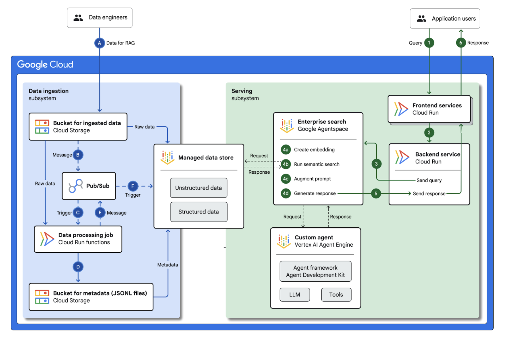

# RAG Infrastructure for Generative AI Applications using Google Agentspace and Vertex AI


## Overview

This project aims to automate the process of updating a Vertex AI datastore with information from new documents uploaded to Google Cloud Storage bucket. The goal is to streamline the creation of a knowledge base that can be used for AI-powered and Enterprise Search Applications , such as AgentSpace, for querying and analyzing data.
To make the project based on real use case, we purposing it to ingesting rental lease pdf documents.


1. New Document Upload: When a new lease document (in PDF format) is uploaded to a Cloud Storage bucket, a trigger is activated.
2. Automated Metadata Extraction:  The system automatically extracts key metadata from the uploaded PDF document. This includes information like lease dates, parties involved, key terms, and other relevant details.
3. JSONL Data Generation: The extracted metadata is transformed into a JSONL file, a format suitable for ingestion into Vertex AI.
4. Incremental Datastore Update: The newly generated JSONL file is used to incrementally update the Vertex AI datastore. This ensures the datastore always reflects the latest information from uploaded lease documents.
5. Structured Data Storage: The extracted metadata, along with a reference to the original document, is stored in a Firestore database. This creates a persistent, structured record for future auditing and administrative dashboards.

### Benefits
- Automated Workflow:  Eliminates the manual process of metadata extraction, updating the datastore, saving time and reducing errors.
- Real-time Data Integration:  Ensures the AI knowledge base is always up-to-date with the latest lease information.

## Architecture
 This repository only handles the infrastructure for data ingestion. The serving components will be added later.


### Data Ingestion
- **Lease PDF Files:** All documents are uploaded to a designated Cloud Storage path (`target_path_prefix`) for direct and automatic processing.
- **Processing Flow:** Upon upload, each document triggers the following sequence:
  1. Key metadata is extracted from the PDF (e.g., property address, lease dates, rent amount, and document language).
  2. The metadata is stored in Firestore for logging and record-keeping.
  3. A message is published to a Pub/Sub topic to initiate the Vertex AI datastore update.
  4. File Upload Trigger: Uploading a new PDF to Cloud Storage triggers a Pub/Sub message, initiating the data ingestion pipeline.
  5. Metadata Extraction: A Cloud Function extracts metadata (e.g., lease date, parties involved) from the PDF and stores the result in a Firestore database.
  6. Datastore Update Trigger: The extracted metadata is published to a second Pub/Sub topic to begin the Vertex AI datastore update process.
  7. JSONL Generation: Another Cloud Function (the "Datastore Refresher") is triggered, which transforms the metadata into the required JSONL format and saves the file to a Cloud Storage bucket, ready for ingestion by Vertex AI.


### Generative AI Application
- Vertex AI Datastore: The JSONL data is ingested into a Vertex AI Datastore. The system utilizes Vertex AI Datastore to store and manage information related to the lease agreements, including extracted metadata and relevant contextual information.

- Gemini Foundation Model: The Gemini model is leveraged for its ability to understand and generate natural language.
- AI Enterprise Search: The Datastore is indexed, enabling efficient retrieval of lease-related information by downstream by AI Applications, like AgentSpace.

### Serving [Not Implemented Yet]
- Search/Chat UI: A user-friendly interface built using Cloud Run provides a search/chat experience. Users can query the system using natural language to retrieve information about lease agreements or ask questions about their contents.
- Cloud Run: The user interface is deployed on Cloud Run, a serverless platform for containerized applications, ensuring scalability and cost-efficiency and to host the UI.


### Google Cloud Platform (GCP) Deployment Guide

This document outlines the steps to deploy a system for extracting metadata from lease PDF documents using Google Cloud Platform (GCP) services. This system uses Cloud Functions, Pub/Sub, Firestore, and the Vertex AI Gemini model.

**Assumptions:**

*   **GCP Project:** You have an existing Google Cloud Platform (GCP) project.
*   **Discovery Engine Datastore:** You have an existing Agent Builder Datastore.
*   **GCS Bucket for Lease PDFs:** You have an existing Google Cloud Storage (GCS) bucket for lease PDF documents (`lease_pdf_bucket_name`).
*   **Target Path Prefix in GCS:** The GCS bucket for lease PDFs has the directory prefix specified in `target_path_prefix`.

**Terraform Configuration (terraform.tfvars):**

```
project_id                   = "your-gcp-project-id"
project_number               = "your-gcp-project-number"
region                       = "your-gcp-region"
unstructured_data_bucket_name = "your-gcs-bucket-name"
metadata_generation_topic_id  = "your-metadata-generation-topic-id"
update_datastore_topic_id     = "your-update-datastore-topic-id"
firestore_db_name             = "your-firestore-db-name"
auto_process_path_prefix      = "your-auto-process-path-prefix"
review_path_prefix            = "your-review-path-prefix"
firestore_collection_name     = "your-firestore-collection-name"
gemini_model_name             = "your-gemini-model-name"
vertex_ai_location            = "your-vertex-ai-location"
overwrite_existing_metadata   = true # or false
```

**Resources to be Provisioned:**

This Terraform configuration will provision the following resources:

*   **Service Account:**  
    *   A dedicated service account for Cloud Functions with the necessary IAM roles to access GCS, Firestore, Pub/Sub, and Vertex AI resources.
*   **Cloud Functions:**  
    *   `lease-metadata-generator`: Triggered by new PDF uploads to the specified GCS bucket and path. Extracts metadata using the Gemini model, stores metadata in Firestore, and publishes a message to a Pub/Sub topic.
    *   `refresh-datastore-document`: Triggered by Pub/Sub messages. Reads metadata from Firestore, generates a JSONL file, uploads it to GCS, and triggers the Vertex AI Discovery Engine to update the datastore.
*   **Pub/Sub Topics:**  
    *   `lease-metadata-generation-topic`: Used for communication between Cloud Functions after metadata extraction.
    *   `update-datastore-topic`: Used to trigger the datastore refresh process.
*   **IAM Roles:**  
    *   Grants required permissions to the Cloud Function service account for accessing GCS, Firestore, Pub/Sub, and Vertex AI Discovery Engine.
*   **Firestore Database:**  
    *   Creates and configures a Firestore database and collection for storing extracted lease metadata.
*   **Google Cloud Storage Bucket:**  
    *   Uses an existing bucket for lease PDFs and manages paths for auto-processing and review.
*   **Vertex AI Discovery Engine Integration:**  
    *   Configures resources to enable incremental updates to the Vertex AI datastore using generated JSONL files.

---

### Manual Steps Required After Terraform Deployment

Some steps must be performed manually, as they are not supported by Terraform:

1. **Upload a Sample Lease PDF:**
    * Upload a sample lease PDF document to your GCS bucket defined by `unstructured_data_bucket_name` in `terraform.tfvars`, under the prefix specified by `auto_process_path_prefix`.
    * For example, you can upload a PDF from `assets/sample_lease_pdfs/` to:  
      `gs://<unstructured_data_bucket_name>/<auto_process_path_prefix>/<your_sample_lease.pdf>`

2. **Verify Data Ingestion Workflow:**
    * The upload will trigger the data ingestion workflow.
    * If successful, a JSONL file will be generated in the `${project_id}-lease-metadata` bucket under the `jsonl-metadata` path.
    * Confirm that the JSONL file is created in:  
      `gs://${project_id}-lease-metadata/jsonl-metadata/`

3. **Manually Link the Data Store to the JSONL Path:**
    * You must manually link the "Unstructured Documents Data Store" with the JSONL path created above.
    * Follow the official guide here:  
      [Import data from Cloud Storage to Vertex AI Search Datastore](https://cloud.google.com/generative-ai-app-builder/docs/create-data-store-es#discoveryengine_v1_generated_DocumentService_ImportDocuments_sync-console). You can skip creating a new data store steps as it is already created.
    * This step ensures the PDF and its extracted metadata are ingested into the Vertex AI Discovery Engine.

4. **Verify Document Ingestion:**
    * Go to the Datastore UI in the Google Cloud Console.
    * Click the "View Document" button to confirm that the PDF and its metadata have been ingested successfully.

**Deployment Steps:**

1.  **Set Up GCP Project:**
    *   Ensure you have the Google Cloud SDK (gcloud) installed and authenticated with your GCP project.
    *   Set the default project ID:
        ```bash
        gcloud config set project your-project-id
        ```
2.  **Fork the Repository:**
    *   Fork (don't clone) the Terraform repository for this project to your VM or local machine.
3.  **Prepare terraform.tfvars:**
    *   Rename `terraform.tfvars.example` to `terraform.tfvars` if it exists.
    *   Update the `terraform.tfvars` file with your specific project ID, project number, bucket names, data store ID, and other necessary configurations. **Important:** Use the values listed in the "Terraform Configuration" section above, replacing placeholders as needed (e.g., `"your-project-id"` should be replaced with your actual Project ID).
4.  **Initialize Terraform:**
    *   Navigate to the Terraform directory in your local machine
    *   Run the following command to initialize Terraform:
        ```bash
        terraform init
        ```
5.  **Review the Plan:**
    *   Run the following command to preview the changes that will be made:
        ```bash
        terraform plan
        ```
    *   Carefully review the plan to ensure all resources are created as expected.
6.  **Apply the Configuration:**
    *   Apply the Terraform configuration with the following command:
        ```bash
        terraform apply
        ```
    *   Type `yes` when prompted to confirm.
7.  **Monitor Deployment:**
    *   Terraform will output the progress of resource creation.
    *   You can also monitor the creation of resources in the GCP console.
8.  **Post-Deployment:**
    *   After successful deployment:
        *   Upload a sample lease PDF to your GCS bucket (`lease_pdf_bucket_name`) under the directory defined by the `target_path_prefix` (e.g. `gs://<lease_pdf_bucket_name>/<target_path_prefix>/<lease_document>.pdf`)
        *   The metadata will be automatically extracted and stored in firestore, and imported into the discovery engine.
        *   Monitor Cloud Function logs in the GCP console for any issues.
9.  **Clean Up**
  * Run the `terraform destroy` command when done with the resources:
        ```bash
        terraform destroy
        ```
**Important Notes:**

*   **Gemini Model:** Gemini model used is `gemini-2.5-pro`. You can select another model from this [link](https://ai.google.dev/gemini-api/docs/models/gemini). Ensure that your project has access to this model, and that billing is enabled for Vertex AI.
*   **Cloud Function Memory:** Adjust the memory and timeout settings in the Terraform configuration for Cloud Functions if needed.
*   **Template Prompts:** Make sure that the prompts/metadata\_generation\_prompt.j2 file is present in the prompts folder as outlined in the code. Refactor the prompt if needed to better suit your business use case.

**Troubleshooting:**

*   **Terraform Errors:** Review the error messages from the `terraform plan` and `terraform apply` commands. Double-check syntax and values in `terraform.tfvars`.
*   **Cloud Function Errors:** Check the logs of the Cloud Functions in the GCP console.
*   **Service Account Issues:** Verify that the service account has all the needed permissions.

